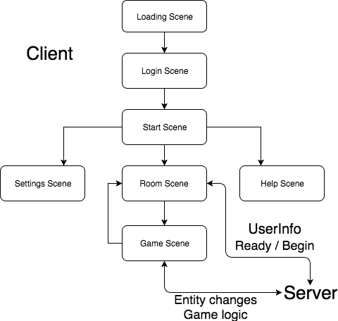

# 客户端

## 架构

### Controller

> 控制层，和用户、服务器的交互。

主要负责调控人物的移动，实时更新人物移动信息，房间界面内聊天窗口的同步更新。

### Manager

> 中间层，负责对游戏对象的控制（Player, Bubble, Prop），类似于 `repository` 一样的存在。

具体控制人物移动，泡泡的释放、爆炸，道具的安放以及被采集。

### Model

> 对象层，具体对象的实现

人物，泡泡，道具的初始化和各种状态的储存，人物方面：运动的初始化，运动速度的获取，人物释放泡泡，采集道具，生存状态；泡泡方面：泡泡的初始化，泡泡爆炸状态（方向），泡泡爆炸的效果；道具方面：初始化，类型存储

### Network

> 网络层，同样采用[回调函数](server?id=serverh-cpp)的方式不同的数据调用不同的函数

### Operator

> 操作适配器，针对不同的系统使用不同的操作方式

* Win32 / Mac OS / Linux: 使用键盘控制
* iOS / Android: 采用虚拟摇杆

### Scene

> 游戏场景

具体见[游戏流程](#游戏流程)

#### Scene/UI

> 一些界面的组件

* ChatBox: 设置于房间界面中，可供准备时互相交流
* CheckBox: 设置界面中作为音效和背景音乐的开关
* ResultBox: 游戏界面中，记录玩家胜负状态
* RoleBox: 房间列表，向用户提供角色选择功能
* UserBox: 房间界面显示用户相关信息（用户名及准备状态及玩家角色）
* GameMap: 提供地图选择功能（目前配置了两张地图）

### Utils

> 辅助、通用函数

* AnimationLoader

对 cocos2d-x 的动画进行简单的封装，避免繁琐的加载，运行过程

* GameAudio

对 cocos2d-x 的声音引擎进行简单封装，可以保存用户对音乐的设置（开关）。

### Settings.h

> 保存游戏的基本配置

避免每次改配置都要一个文件一个文件去改，但是增加了编译时间，有利有弊。

## 游戏流程

首先是 loading 界面，进入开始界面后，音乐开始启动，开始界面课设置音效和查看帮助菜单，提供退出（exit）按钮。

Play 进入 login 界面，登录名有自动记忆功能，房间界面提供选人物和聊天功能，各自准备好后开始游戏。

## 设计模式

* 观察者模式

基于 cocos2d-x 提供的 EventCustom 实现的观察者模式，进行组件间的通讯与广播

* 单例模式

Client, GameAudio, User 都采用了单例模式。

Client 在不同场景间切换要保存连接，所以采用了单例模式。

GameAudio 保存了玩家对音乐的设置，全局唯一。

User 保存当前玩家的属性，玩家唯一。

## 使用的 C++11 特性

### lambda 表达式

在进行事件绑定的时候，大多采用了 lambda 表达式，不需要再创建过多的函数。

### 回调函数

这个特性主要用在了网络通讯的部分。见[room.h/.cpp](server?id=roomh-cpp)

### 初始化列表

例如，在`Operator/Rocker.cpp`的 [104行](https://github.com/CrazyArcade/CrazyArcade/blob/master/Classes/Operator/Rocker.cpp#L104)

### 常量表达式 (constexpr)

在配置文件`Settings.h`中使用